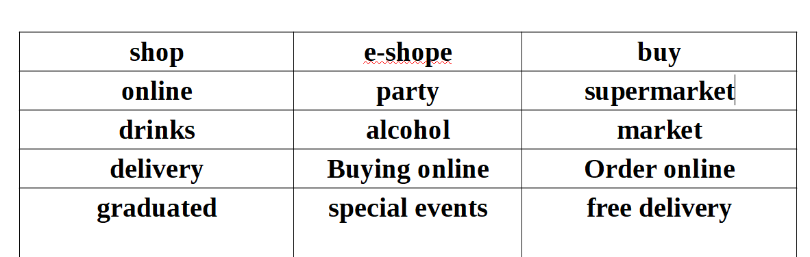

# E-commerce (Getränke)

## Overview

This project was designed, developed, and based on the idea of online shop to create a simple and easy method for the customers to buy drinks online. The users are given the possibility to add the order to thier basket, update it and delete it at any time before the payment. All these functionalities can be accessed by any user with an account. The admins have special permissions for controlling the data (CRUD). The website was made for real life simulation, although the shop and drinks don't exist in real life. The web site was developed using HTML, CSS, JS, Python "Django" and data are stored in an Elephant SQL database. The project can be accessed through this link [Getränke](https://ecommercepp5-a121ad0ae944.herokuapp.com/).

### Features
Some elements appear on all of the pages of the website, like navbar and the footer.

- Navbar
  - The navigation is fixed at the top of the page and esay to use. It includs three buttons "Home","Order Here" and either or "log out" and "Profile" when the user logged in "log in" and " register" when the user logged out and "Management" if the user is superuser.
  - Also, the navbar is responsive to different screen sizes.

- Footer
    The footer includes the contact of the shop, email and social media links.

### Home
This is the main page, and just includes background and if the user is authenticated can see the basket in right top of the page.

### Order Here
- This page is available to everyone.
On this page where customers can find products and see the details of each product.
- When the user clicks on any item, it displays the item individually, where the user can add the order to the cart in the quantity a user needs, provided that it is less than 1000

### Authentication
  - This dropdown button includs the sing up, log in-out and profile buttons.

#### Sign Up
On this page the user can click on "Sign Up" if the user wants to create an account. 

#### Login
On this page, the user only has to enter their username and password to log in to the page. It has a link to the Sign Up page if the user has no account. The user will automatically be able to see the basket.

#### Logout
When the user is logged in and clicks on "Logout" up on the navigation bar, the user will automatically be redirected to this page first. The user receives the question if they are sure they want to log out. To log out they click on the button "confirm" 

## UX

### Strategy

#### Project Goal
    This Project was created for an E-shop that is useful for customers and shop staff.

#### User story
-  The purpose of the project is to give the possibility for the cutomers to buy drinks online. In addition, the users have the ability to view, update (edit) and delete thier order before the payment any time they want, as long as they are logged in. The webiste is easy for the user to navigate through.

- Also, any visitor to the website can view what in the shop's list, Although they can't order untill they logged in.

    - As a User I can recover my password whenever I forgot it so that I can be able to access my profile again
    - As anAdmin I can create, edit, read and delete so that manage the E-shop
    - As a User I can have my personal profile so that I view my order and history data
    - As a User I can Add or delete the products from the basket so that I have flexibility to fix my order
    - As a User I can order and pay so that I do complete buying processes
    - As a user I can search for my product so that I don't have to keep scoring up or down to find it
    - As a User I can receive confirmation email so that I manage my order or check it out
    - As a User I can confirm my payment before complete the payment so that I have flexibility of withdrawing my order
    - As a User I can sort the products so that I find the product that I look for easily and quickly
    - As a User, I can register an account, so that I can access benefits of the project.
    - As a User I can see all the items so that I order or buy
    - As a user I can navigation easily and contact so that I can find the content
    - As a User I can see the details of each product so that I know what to order
    - As a User I can see what minimum price of order so that my order can be processed
    - As an Admin I can ask the user to subscribe so that I can have their data
    - As a User I can have my data saved so that don't have to to refill it each time I need to process

### Structure
The user can access the home page and Order Here page without having a profile, but to be able to order, the user must create an account. Then the user will have their own profile and basket so that they can add any item to their basket. The user will receive a text message confirming the addition with the ability to modify or delete the items from their basket. Also, if the user returns to the home page, they can still come back at any time to edit or delete from their basket. 

### Scope
 - Make a clear and easy design for the users
  - Simple and intuitive User Experience.
  - Add information of contact and social media.
  - Create a responsive design for desktop, tablet, and mobile devices.
  - Allow access to the Profile page only for client type of users
  - Create E-commerce system feature that allow the admin to display, edit and delete the item from the shop's lits.
  - Create E-commerce system feature that allows the users to display, edit, and delete the item from the basket.
  - Create a Profile page for the user, so the user can order.

### Skeleton
The project uses the ElephentSQL relational database for storing the data. There was just one diagram created for this project.

### Surface
  - Flex-box
  - Hover effects
  - Color palette:
    - 
  - Fonts imported from fonts.googleapis [google.font](https://fonts.google.com/)
    - Lucida Grande,DejaVu Sans,
    - Bitstream Vera Sans
    - Verdana, Geneva, Tahoma, sans-serif
    - Arial 
    - Courier New Courier, monospace
    - Roboto
    
## Technologies Used
### Languages
  - [HTML](https://developer.mozilla.org/en-US/docs/Web/HTML) was used as the foundation of the site.
  - [CSS](https://developer.mozilla.org/en-US/docs/Web/CSS) was used to add the style and layout of the site.
  - [JavaScript](https://developer.mozilla.org/en-US/docs/Web/JavaScript) was used for interaction
  - [Python](https://www.python.org/) Used for back end and front end

### Frameworks:
  - [Django](https://www.djangoproject.com/) Used as a framework
  - [Jquery](https://jquery.com/) For adding predefined function between backend anf fronend 
  - [Bootstrap](https://getbootstrap.com/docs/4.6/getting-started/introduction/) For adding predefined styled elements and creating

### Other tools:
  - [Gitpod](https://www.gitpod.io/) Hosted the workspace.
  - [Heroku](https://id.heroku.com/login) Used for deploying the project
  - [Favicon.io](https://www.favicon.cc/) Used for generating the website favicon
  - [Cloudinary](https://cloudinary.com/) For storing static data
  - [Stripe](https://stripe.com/de?utm_campaign=DE_en_Search_Brand_Stripe_EXA-866170064&utm_medium=cpc&utm_source=google&ad_content=301948784636&utm_term=stripe&utm_matchtype=e&utm_adposition=&utm_device=c&gad_source=1&gclid=Cj0KCQjws560BhCuARIsAHMqE0GJZhP880Wbgg5rHfjuen4ObDsZMnwGIQHTWVUhPpRK-xsHiIacLkAaAry3EALw_wcB) for payment
  - [GitHub](https://github.com/) Used for hosting the source code of the program
  - [Chrome-Del-Tools](https://developer.chrome.com/docs/devtools/) For debugging the project
  - [Mailchimp](https://us14.admin.mailchimp.com/audience/contacts/) for subscription
  - [W3C](https://validator.w3.org/#validate_by_input) HTML Validator Used for validating the HTML
  - [Google-Fonts](https://fonts.google.com/) for typography
  - [CI Python Linter](https://pep8ci.herokuapp.com/#) Used to validating Python
  - [Font-Awesome](https://fontawesome.com/) For creating attractive UX with icons responsiveness
  - [JsHint](https://jshint.com/) used for validating the javascript code
  - [Jigsaw](https://jigsaw.w3.org/css-validator/) CSS Validator Used for validating the CSS
  - [app-diagrams](https://app.diagrams.net/) Used to design the RED
  - Lighthouse 
  - [elephantsql](https://www.elephantsql.com/) Where the DB is storing
  - [XML-sitemaps](https://www.xml-sitemaps.com/) to create sitemap
  - gunicorn
  - [django-allauth](https://docs.djangoproject.com/en/5.0/howto/deployment/wsgi/gunicorn/) Used for the authorization
  - [amiresponsive](https://ui.dev/amiresponsive) Used to check responsive screen

## Deployment 

### Deployment to Heroku

#### Install the dependencies:
  - Open the terminal window and type:
    - pip3 install -r requirements.txt.
    - Create a .gitignore file in the root directory of the project where you should - add env.py.
    - Create a .env file. and added the following.
    - Added "DEVELOPMENT" in os.environ to DEBUG in setting.py.
    - Added '.herokuapp.com' in the setting to ALLOWED_HOSTS.

  - import os:
    - os.environ['SECRET_KEY'] = 'Add a secret key'.
    - os.environ['DATABASE_URL'] = 'will be used to connect to the database'.
    - Also add os.environ['DEVELOPMENT'] = "True" in env.py.
    - Push to GitHub.

  - Migrate by Run the following commands in a terminal:
    - python3 manage.py makemigrations.
    - python3 manage.py migrate.

  - Setting up Heroku
    - Go to the Heroku website Heroku.

    - Log in or create a Heroku account.

    - Login to Heroku and choose Create App.

    - Click New and Create a new app.

    - Choose a name and select your location.

    - Go to the Resources tab.

    - From the Resources list select Heroku Postgres.

    - Navigate to the Deploy tab

    - Click on Connect to Github and search for your repository.

  - Navigate to the Settings tab.

  - Click on the "Settings" tab and then on "Reveal Config Vars".

  - Delete "DISABLE_COLLECTSTATIC = 1" from the list.

  - Add to the list:
    - CLOUDINARY_URL = API,
    -  DATABASE_URL = API,
    -  SECRET_KEY = API,
    - EMAIL_HOST_PASS = API,
    - EMAIL_HOST_USER = API,
    - SECRET_KEY = API,
    - STRIPE_WH_SECRET = API 

  - Now click on the tab "Deploy"
  - and then on the button "Deploy Branch" at the bottom of the page. - 

  - When it's deployed, Click on "Open App" to access the website.

  - Here is the website [Getränke](https://ecommercepp5-a121ad0ae944.herokuapp.com/).

#### Stripe
  - Register for a Stripe account.
  - in the Developers section, click on the API section and copy the publishable and secret keys.
  - Add STRIPE_PUBLIC_KEY and STRIPE_SECRET_KEY to settings.py and to Heroku, using the values found in the API section.
  - Access the webhooks section and create a webhook.
  - Choose all events to be visualised and add endpoint.
  - Add the STRIPE_WH_SECRET variable to the environment and to Heroku.

## keywords
  

Testing
I have tested the project by the following points

Validator Testing
Python

Passed the code to PEP8.
  
HTML

No errors were returned when passing through the official W3C validator
  
CSS

No errors were found when passing through the official (Jigsaw) validator

JavaScript

Undefined bootstrap was checked and there are no error Jshint validator.

The website has been tested and works on different screen sizes and is responsive.

Lighthouse

Manually checking
General Tests
It has been tested and works in several web browsers such as Firefox and Edge.
All alerts disappear after four seconds.
The user can't book an invalid date or multiple appointments.
It was made sure that each user had their own appointment.
The user gets alert messages when they log in or log out.
The navigation stays at the top of the page.
Booking system
Back end connected with front end.
It shows a message for the user when they entered an invalid date or multiple appointments or a taken appointment.
It takes the user to a confirmation message that includes the information of the appointment.
Delete and Edit are functioning
It allows the user to delete, edit, and read the appointment at any time.
It gives the user a chance to undelete the appointment after clicking on delete bottom.
Authorization
Sign-Up
The Sign-Up page works good.
The link to the Log-in page works correctly.
Log-in
The Log-in page works good.
The link to the Sign-Up page works correctly.
The user has to enter the user details correctly to be able to log in.
Log-out
The Log-out page works good.
The button works good.
Bugs
Fixed bugs
The error was solved by deleting the duplicate id. 

The elements were unclear. It was fixed by adding background.  

It wasn't clear to the user that they could book only one appointment. It was fixed by adding a message at the top of the page. 

Unfixed bugs
The user can't see the available and unavailable appointments before choosing on the date.
ERD

Credits
inspiration was taken from Code Institute
Icons are from Font-Awesome.
This website uses Bootstrap.
Images on this website are hosted and managed by Cloudinary.
Fonts are from Google-Fonts.
This website is powered by Django.
To check representative screen amiresponsive.
Used to test JavaScript JsHint.
Used to stor DB elephantsql.
Used to test CSS Jigsaw CSS Validator.
Used to test HTML code W3 W3C HTML Validator.
Used for Favicon.
Used to design the RED app-diagrams.
Used to check resporesponsive screens responsiveviewer
Media
An image was taken from depositphotos.
Images were taken from 123rf.
An image was taken from pixabay.
About
No description, website, or topics provided.
Resources
 Readme
 Activity
Stars
 0 stars
Watchers
 1 watching
Forks
 0 forks
Releases
No releases published
Create a new release
Packages
No packages published
Publish your first package
Deployments
76
 ppfour last month
+ 75 deployments
Languages
JavaScript
38.9%
 
CSS
35.6%
 
HTML
16.8%
 
Python
8.7%
Suggested workflows
Based on your tech stack
Node.js logo
Node.js
Build and test a Node.js project with npm.
Webpack logo
Webpack
Build a NodeJS project with npm and webpack.
Publish Node.js Package logo
Publish Node.js Package
Publishes a Node.js package to npm.
More workflows
Footer
